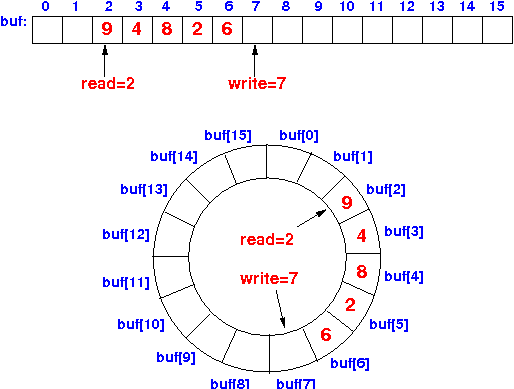
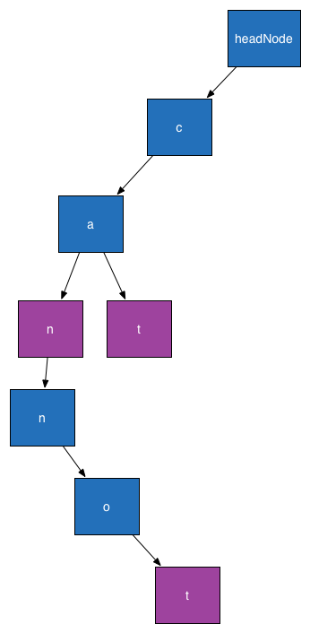

CS241 Final Exam
===================

Posted: Monday  April 28
Due:    Friday  May 2

Rules
--------

+ You are to work alone on these problems
+ You cannot look for solutions (code) to these problems

Text Archiver
----------------

+ Fundamental Data Structure: Associative array (Dictionary)
+ Deliverable: textarchiver.py

You are tasked to create a class for compression and decompression of text for ebooks. Plain-text books encoded as a long string will serve as input to the compress method. As new prefix chains are discovered that are not already in the dictionary, those prefixes will be appended to the table. Inside of the data directory is Oliver Twist by Charles Dickins.  You will employ one of the most popular and oldest entropy encoders called the LZW algorithm. The encoding step works as follows:

+ Assume a dictionary is initially empty and used as a symbol table
+ For every character in an input string:
+ Append the character to a 'prefix' string
+ If prefix exists already exists in the dictionary, continue
+ Otherwise, add the prefix to the dictionary with a unique number id describing it
+ Next, place that prefix symbol down to output, and clear the string, and repeat
    
For decoding the compressed output:

+ Flip the key-value pairs in the dictionary with:
+ decodeTable = {y:x for x,y in prefixes.iteritems()}
+ For each integer in the input,
+ Append the character value found in the decodeTable

I was able to achieve roughly 15% compression ratio using the LZW algorithm for this text.

Signal Processing
----------------------

+ Fundamental Data Structure: Circular Buffer
+ Deliverable: circularbuffer.py

Many signal processing algorithms such as for audio and images, use circular buffers. One reason that circular buffers are used is that they are efficient for inserting and removing samples into a buffer without requiring dynamic allocation of memory during run-time. The values in the buffer create a time-window of samples that have been inserted recently. FIR filters are generally used for all sorts of applications such as smoothing, noise removal, and blurring of the data. We will use our circular buffer to implement an FIR filter.

Circular buffers are essentially fixed-size arrays. Logically, they are a specific kind of queue that stores values conceptually in a ring. The logical beginning and end of the buffer changes with every insert and deletion of values. Upon initialization, the circular buffer is filled with 0's. Should the circular buffer be filled, and a new value is pushed into the queue, the beginning value of the queue is removed. If the circular buffer is filled and a new value is inserted, the value in the beginning of the buffer is removed from memory. The value for the start position can be represented as an integer index. Either an end index or a length of the buffer can be stored to determine the end of the buffer. I recommend using the modulus operator for keeping indices within the size of the array.

Spell Checker
---------------------

+ Fundamental Data Structure: Trie
+ Deliverable: trie.py

Many operations require very fast lookups of strings. One classic application of this is for spell checking in an application. Spell checking should be executed after the completion of writing each word. Checking to see if the word exists in a list of correctly spelled words becomes slow if the number of words in the dictionary are large. Therefore, typically a specific kind of data structure called a trie (named for reTrieval) is used for this purpose. The trie is a special kind of tree where there are 26 children for each node. Each node has a boolean flag for whether ending at that particular letter in the tree represents a correctly spelled word or not. If the next letter is a 'c', make sure that you visit the node stored at children[2].

